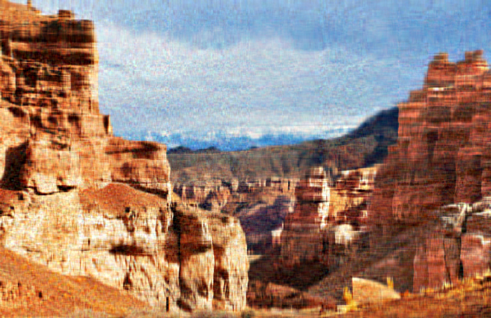

# rsvd.jl

A lightweight Julia project implementing a randomized Singular Value Decomposition (SVD) and benchmarking it against Julia's standard SVD routine. This implementation is based on the algorithm described in "Finding Structure with Randomness: Probabilistic Algorithms for Constructing Approximate Matrix Decompositions" by Halko, Martinsson, and Tropp.

## Algorithm

The randomized SVD algorithm provides a fast and accurate way to compute a low-rank approximation of a matrix. The core idea is to find a smaller matrix `Q` that captures the action of the input matrix `A`. The SVD is then performed on the much smaller matrix `Q'*A`.

The implementation follows these steps:

1.  **Find an approximate basis for the range of A**:
    *   Generate a random Gaussian matrix `Omega`.
    *   Form the matrix `Y = A * Omega`. The columns of `Y` are random linear combinations of the columns of `A`.
    *   Compute an orthonormal basis `Q` for the columns of `Y` using a QR decomposition.

2.  **(Optional) Power Iterations**:
    *   To improve the accuracy of the basis `Q`, power iterations can be applied. This step helps to capture singular vectors corresponding to smaller singular values more effectively. The implementation in `main.jl` includes this.
    *   For `q` iterations: `Y = A' * Q`, `Q, _ = qr(Y)`; then `Y = A * Q`, `Q, _ = qr(Y)`.

3.  **Form the smaller matrix and compute its SVD**:
    *   Project `A` onto the subspace spanned by `Q`: `B = Q' * A`.
    *   Compute the SVD of the small matrix `B`: `U_B, S, Vt = svd(B)`.

4.  **Recover the SVD of A**:
    *   The singular values `S` and the right singular vectors `Vt` of `B` are good approximations for those of `A`.
    *   The left singular vectors of `A` can be recovered by `U = Q * U_B`.

## Getting Started

### Prerequisites

You need to have Julia installed on your system. You can download it from the official Julia website.

### Running the code

The project is contained within a single file, `main.jl`. To run the included tests and experiments, simply execute the file from your terminal:

```bash
julia main.jl
```

## Usage

The main function for computing the randomized SVD is `randsvd`.

```julia
using LinearAlgebra

# randsvd(A::AbstractMatrix, k::Int64; p::Int64=5, q::Int64=1)
# A: The input matrix
# k: The target rank of the approximation
# p: Oversampling parameter (default: 5)
# q: Number of power iterations (default: 1)

A = randn(1000, 500)
k = 20

U, S, Vt = randsvd(A, k; p=10, q=2)

# Reconstruct the low-rank approximation
A_approx = U * Diagonal(S) * Vt
```

## Results and Benchmarking

The script `main.jl` includes a small unit test and a synthetic experiment to compare the accuracy of `randsvd` against the deterministic SVD provided by `LinearAlgebra.svd`. The results demonstrate that the randomized SVD achieves a remarkable level of accuracy, often indistinguishable from the optimal deterministic result for the given tasks.

### Experiment Output

Here is the output from running `julia main.jl`:

```
Running small unit test...
Frobenius error randomized: 52.949127732651775
Frobenius error deterministic: 52.94912773265177
Relative error: 0.00%

Running synthetic experiment (operator norm errors)...
k= 5 | rand_err=0.639912 | det_err=0.639912 | rel_err=0.00%
k=10 | rand_err=0.233534 | det_err=0.233534 | rel_err=0.00%
k=15 | rand_err=0.080630 | det_err=0.080630 | rel_err=-0.00%
k=20 | rand_err=0.000000 | det_err=0.000000 | rel_err=0.00%
k=30 | rand_err=0.000000 | det_err=0.000000 | rel_err=0.00%
```

As shown, the relative error between the randomized SVD approximation and the best-rank `k` deterministic approximation is virtually zero. This confirms the high accuracy of the implementation.

## Image Reconstruction Comparison

To demonstrate the practical application of randomized SVD, we performed image compression experiments using rank-50 approximations. The results show that randomized SVD produces visually identical reconstructions to the deterministic SVD, while being significantly faster for large images.

### Rank-50 Reconstruction Results

Below are comparison images showing original images alongside their rank-50 SVD reconstructions:

<table>
  <tr>
    <td align="center">
      
      <br/>
      <em>Figure 1: Canyon - Deterministic Rank-50 Reconstruction</em>
    </td>
    <td align="center">
      
      <br/>
      <em>Figure 2: Canyon - Random Rank-50 Reconstruction</em>
    </td>
  </tr>
  <tr>
    <td align="center">
      
      <br/>
      <em>Figure 3: Pelican - Deterministic Rank-50 Reconstruction</em>
    </td>
    <td align="center">
      
      <br/>
      <em>Figure 4: Pelican - Random Rank-50 Reconstruction</em>
    </td>
  </tr>
  <tr>
    <td align="center">
      
      <br/>
      <em>Figure 5: Kids - Determintic Rank-50 Reconstruction</em>
    </td>
    <td align="center">
      
      <br/>
      <em>Figure 6: Kids - Random Rank-50 Reconstruction</em>
    </td>
  </tr>
</table>

The rank-50 approximations capture the essential visual features of the original images while using only 50 singular values instead of the full rank. This demonstrates how SVD can be used for effective image compression, reducing storage requirements while maintaining high visual quality. The randomized SVD algorithm produces nearly identical results to the deterministic approach, validating its effectiveness for real-world applications.
